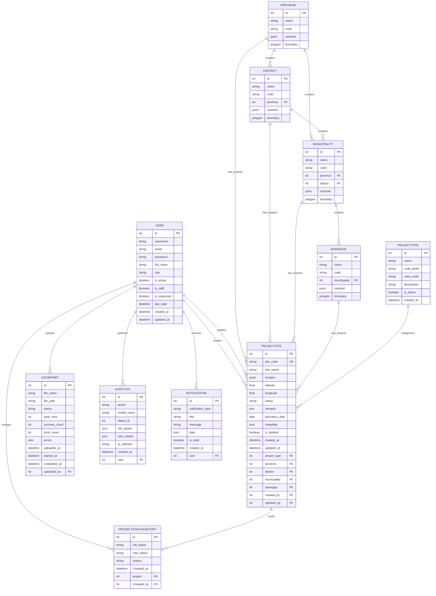

# Implementation Architecture
# Django Project Tracking Management System v2.0

**Version:** 2.0  
**Date:** February 2, 2026  
**Status:** Architecture Phase - Ready for Implementation  

---

## Table of Contents

1. [Overview](#1-overview)
2. [Directory Structure](#2-directory-structure)
3. [File Inventory](#3-file-inventory)
4. [Dependencies](#4-dependencies)
5. [Configuration Templates](#5-configuration-templates)
6. [Implementation Roadmap](#6-implementation-roadmap)
7. [Database Schema Overview](#7-database-schema-overview)
8. [API Structure Overview](#8-api-structure-overview)

---

## 1. Overview

This document serves as the comprehensive blueprint for implementing the Django Project Tracking Management System v2.0. It provides a complete file structure, inventory of all files to be created, dependency specifications, configuration templates, and a step-by-step implementation roadmap.

### System Architecture Summary


---

## 2. Directory Structure

### 2.1 Complete Project Structure

```
djangoProject/
├── backend/                          # Django Backend
│   ├── config/                       # Django project configuration
│   │   ├── __init__.py
│   │   ├── settings/                 # Environment-specific settings
│   │   │   ├── __init__.py
│   │   │   ├── base.py              # Base settings
│   │   │   ├── development.py       # Development settings
│   │   │   ├── production.py        # Production settings
│   │   │   └── test.py              # Test settings
│   │   ├── urls.py                  # Root URL configuration
│   │   ├── wsgi.py                  # WSGI configuration
│   │   ├── asgi.py                  # ASGI configuration (Channels)
│   │   └── celery.py                # Celery configuration
│   │
│   ├── apps/                         # Django applications
│   │   ├── accounts/                 # User management app
│   │   │   ├── __init__.py
│   │   │   ├── admin.py
│   │   │   ├── apps.py
│   │   │   ├── models.py
│   │   │   ├── serializers.py
│   │   │   ├── views.py
│   │   │   ├── urls.py
│   │   │   ├── permissions.py
│   │   │   └── tests.py
│   │   │
│   │   ├── locations/                # Location hierarchy app
│   │   │   ├── __init__.py
│   │   │   ├── admin.py
│   │   │   ├── apps.py
│   │   │   ├── models.py
│   │   │   ├── serializers.py
│   │   │   ├── views.py
│   │   │   ├── urls.py
│   │   │   └── tests.py
│   │   │
│   │   ├── projects/                 # Project management app
│   │   │   ├── __init__.py
│   │   │   ├── admin.py
│   │   │   ├── apps.py
│   │   │   ├── models.py
│   │   │   ├── serializers.py
│   │   │   ├── views.py
│   │   │   ├── urls.py
│   │   │   ├── filters.py
│   │   │   ├── permissions.py
│   │   │   └── tests.py
│   │   │
│   │   ├── geo/                      # Geospatial queries app
│   │   │   ├── __init__.py
│   │   │   ├── apps.py
│   │   │   ├── views.py
│   │   │   ├── urls.py
│   │   │   └── services.py
│   │   │
│   │   ├── import_export/            # CSV import/export app
│   │   │   ├── __init__.py
│   │   │   ├── apps.py
│   │   │   ├── models.py
│   │   │   ├── serializers.py
│   │   │   ├── views.py
│   │   │   ├── urls.py
│   │   │   ├── tasks.py              # Celery tasks
│   │   │   └── validators.py
│   │   │
│   │   ├── reports/                  # Analytics & reporting app
│   │   │   ├── __init__.py
│   │   │   ├── apps.py
│   │   │   ├── views.py
│   │   │   ├── urls.py
│   │   │   └── services.py
│   │   │
│   │   ├── notifications/            # WebSocket notifications app
│   │   │   ├── __init__.py
│   │   │   ├── apps.py
│   │   │   ├── models.py
│   │   │   ├── consumers.py          # Django Channels consumers
│   │   │   ├── routing.py            # WebSocket routing
│   │   │   ├── services.py
│   │   │   └── tests.py
│   │   │
│   │   └── audit/                    # Audit logging app
│   │       ├── __init__.py
│   │       ├── apps.py
│   │       ├── models.py
│   │       ├── middleware.py
│   │       └── utils.py
│   │
│   ├── core/                         # Shared utilities
│   │   ├── __init__.py
│   │   ├── pagination.py
│   │   ├── permissions.py
│   │   ├── exceptions.py
│   │   ├── utils.py
│   │   └── mixins.py
│   │
│   ├── media/                        # User uploads
│   │   └── uploads/
│   │
│   ├── static/                       # Static files
│   │
│   ├── locale/                       # Translations
│   │
│   ├── logs/                         # Application logs
│   │
│   ├── manage.py                     # Django management script
│   ├── requirements.txt              # Python dependencies
│   └── .env.example                  # Environment variables template
│
├── frontend/                         # React Frontend
│   ├── public/                       # Static assets
│   │   └── favicon.ico
│   │
│   ├── src/                          # Source code
│   │   ├── assets/                   # Images, fonts, icons
│   │   │   └── images/
│   │   │
│   │   ├── components/               # React components
│   │   │   ├── ui/                   # shadcn/ui components
│   │   │   │   ├── button.tsx
│   │   │   │   ├── input.tsx
│   │   │   │   ├── select.tsx
│   │   │   │   ├── table.tsx
│   │   │   │   ├── dialog.tsx
│   │   │   │   ├── dropdown-menu.tsx
│   │   │   │   ├── card.tsx
│   │   │   │   ├── badge.tsx
│   │   │   │   ├── tabs.tsx
│   │   │   │   ├── pagination.tsx
│   │   │   │   ├── toast.tsx
│   │   │   │   ├── toaster.tsx
│   │   │   │   ├── use-toast.ts
│   │   │   │   ├── progress.tsx
│   │   │   │   ├── skeleton.tsx
│   │   │   │   ├── tooltip.tsx
│   │   │   │   └── label.tsx
│   │   │   │
│   │   │   ├── layout/               # Layout components
│   │   │   │   ├── Sidebar.tsx
│   │   │   │   ├── Header.tsx
│   │   │   │   ├── Layout.tsx
│   │   │   │   └── Navigation.tsx
│   │   │   │
│   │   │   ├── auth/                 # Auth components
│   │   │   │   ├── LoginForm.tsx
│   │   │   │   └── ProtectedRoute.tsx
│   │   │   │
│   │   │   ├── dashboard/            # Dashboard widgets
│   │   │   │   ├── StatsCards.tsx
│   │   │   │   ├── StatusChart.tsx
│   │   │   │   ├── ProjectTypeChart.tsx
│   │   │   │   ├── RecentActivity.tsx
│   │   │   │   └── QuickActions.tsx
│   │   │   │
│   │   │   ├── map/                  # Map components
│   │   │   │   ├── ProjectMap.tsx
│   │   │   │   ├── MapMarker.tsx
│   │   │   │   ├── MapControls.tsx
│   │   │   │   ├── MapFilterPanel.tsx
│   │   │   │   └── PopupContent.tsx
│   │   │   │
│   │   │   ├── projects/             # Project components
│   │   │   │   ├── ProjectTable.tsx
│   │   │   │   ├── ProjectForm.tsx
│   │   │   │   ├── ProjectDetail.tsx
│   │   │   │   ├── FilterBar.tsx
│   │   │   │   ├── StatusBadge.tsx
│   │   │   │   └── Pagination.tsx
│   │   │   │
│   │   │   ├── import/               # CSV import components
│   │   │   │   ├── CSVUploader.tsx
│   │   │   │   ├── ImportProgress.tsx
│   │   │   │   ├── ImportResults.tsx
│   │   │   │   └── TemplateDownload.tsx
│   │   │   │
│   │   │   ├── reports/              # Report components
│   │   │   │   ├── ReportBuilder.tsx
│   │   │   │   ├── StatisticsPanel.tsx
│   │   │   │   └── ChartWidgets.tsx
│   │   │   │
│   │   │   ├── users/                # User management components
│   │   │   │   ├── UserTable.tsx
│   │   │   │   └── UserForm.tsx
│   │   │   │
│   │   │   └── shared/               # Shared components
│   │   │       ├── LoadingSpinner.tsx
│   │   │       ├── ErrorMessage.tsx
│   │   │       ├── DataTable.tsx
│   │   │       └── ConfirmDialog.tsx
│   │   │
│   │   ├── pages/                    # Page components
│   │   │   ├── Dashboard.tsx
│   │   │   ├── MapView.tsx
│   │   │   ├── ProjectList.tsx
│   │   │   ├── ProjectCreate.tsx
│   │   │   ├── ProjectEdit.tsx
│   │   │   ├── ProjectDetail.tsx
│   │   │   ├── ImportPage.tsx
│   │   │   ├── Reports.tsx
│   │   │   ├── UserManagement.tsx
│   │   │   ├── UserProfile.tsx
│   │   │   ├── Login.tsx
│   │   │   └── NotFound.tsx
│   │   │
│   │   ├── services/                 # API service layer
│   │   │   ├── api.ts                # Axios instance
│   │   │   ├── auth.service.ts
│   │   │   ├── projects.service.ts
│   │   │   ├── locations.service.ts
│   │   │   ├── import.service.ts
│   │   │   ├── reports.service.ts
│   │   │   └── notifications.service.ts
│   │   │
│   │   ├── stores/                   # Zustand stores
│   │   │   ├── authStore.ts
│   │   │   ├── filterStore.ts
│   │   │   ├── notificationStore.ts
│   │   │   └── mapStore.ts
│   │   │
│   │   ├── hooks/                    # Custom React hooks
│   │   │   ├── useAuth.ts
│   │   │   ├── useProjects.ts
│   │   │   ├── useLocations.ts
│   │   │   ├── useSocket.ts
│   │   │   ├── useMapData.ts
│   │   │   └── useToast.ts
│   │   │
│   │   ├── types/                    # TypeScript types
│   │   │   ├── index.ts              # Main types export
│   │   │   ├── user.ts
│   │   │   ├── project.ts
│   │   │   ├── location.ts
│   │   │   └── api.ts
│   │   │
│   │   ├── lib/                      # Utility libraries
│   │   │   ├── utils.ts
│   │   │   ├── constants.ts
│   │   │   └── formatters.ts
│   │   │
│   │   ├── config/                   # Configuration
│   │   │   └── routes.ts
│   │   │
│   │   ├── App.tsx                   # Root component
│   │   ├── main.tsx                  # Entry point
│   │   └── index.css                 # Global styles
│   │
│   ├── index.html                    # HTML template
│   ├── vite.config.ts                # Vite configuration
│   ├── tsconfig.json                 # TypeScript config
│   ├── tsconfig.app.json             # TypeScript app config
│   ├── tsconfig.node.json            # TypeScript node config
│   ├── tailwind.config.js            # Tailwind configuration
│   ├── postcss.config.js             # PostCSS configuration
│   ├── components.json               # shadcn/ui config
│   ├── eslint.config.js              # ESLint configuration
│   ├── package.json                  # NPM dependencies
│   └── .env.example                  # Environment variables template
│
├── docs/                             # Documentation
│   ├── IMPLEMENTATION_ARCHITECTURE.md
│   ├── API.md
│   ├── ARCHITECTURE.md
│   ├── BACKEND_GUIDE.md
│   ├── FRONTEND_GUIDE.md
│   ├── SPECIFICATION.md
│   ├── DATABASE.md
│   ├── SETUP.md
│   ├── TESTING.md
│   ├── SECURITY.md
│   ├── DEPLOYMENT.md
│   ├── TROUBLESHOOTING.md
│   └── README.md
│
├── scripts/                          # Utility scripts
│   ├── setup.sh
│   └── seed_data.py
│
├── docker/                           # Docker configuration
│   ├── Dockerfile.backend
│   ├── Dockerfile.frontend
│   └── docker-compose.yml
│
├── nginx/                            # Nginx configuration
│   └── nginx.conf
│
└── .gitignore                        # Git ignore rules
```

---

## 3. File Inventory

### 3.1 Backend Files

#### Configuration Files

| File | Purpose |
|------|---------|
| `config/settings/base.py` | Base Django settings shared across all environments |
| `config/settings/development.py` | Development-specific settings (DEBUG=True, local DB) |
| `config/settings/production.py` | Production settings (security, caching, logging) |
| `config/settings/test.py` | Test-specific settings (in-memory DB, faster tests) |
| `config/urls.py` | Root URL routing configuration |
| `config/wsgi.py` | WSGI application entry point |
| `config/asgi.py` | ASGI application entry point for Django Channels |
| `config/celery.py` | Celery configuration and task discovery |

#### Core Utilities

| File | Purpose |
|------|---------|
| `core/pagination.py` | Custom pagination classes for API responses |
| `core/permissions.py` | Base permission classes (IsAdmin, IsManager, etc.) |
| `core/exceptions.py` | Custom exception classes and handlers |
| `core/utils.py` | Shared utility functions |
| `core/mixins.py` | ViewSet mixins for common functionality |

#### Accounts App

| File | Purpose |
|------|---------|
| `apps/accounts/models.py` | Custom User model with role field |
| `apps/accounts/admin.py` | Django admin configuration for User model |
| `apps/accounts/serializers.py` | User, Login, Password serializers |
| `apps/accounts/views.py` | LoginView, LogoutView, UserViewSet |
| `apps/accounts/urls.py` | Account endpoints (/auth/) |
| `apps/accounts/permissions.py` | Role-based permission classes |
| `apps/accounts/apps.py` | App configuration |

#### Locations App

| File | Purpose |
|------|---------|
| `apps/locations/models.py` | Province, District, Municipality, Barangay models with spatial fields |
| `apps/locations/admin.py` | Admin configuration for location models |
| `apps/locations/serializers.py` | Location serializers |
| `apps/locations/views.py` | Location ViewSets |
| `apps/locations/urls.py` | Location endpoints |
| `apps/locations/apps.py` | App configuration |

#### Projects App

| File | Purpose |
|------|---------|
| `apps/projects/models.py` | ProjectType, ProjectSite, ProjectStatusHistory models |
| `apps/projects/admin.py` | Admin configuration for project models |
| `apps/projects/serializers.py` | Project serializers |
| `apps/projects/views.py` | ProjectViewSet, HistoryViewSet |
| `apps/projects/filters.py` | Django-filter filter classes |
| `apps/projects/urls.py` | Project endpoints |
| `apps/projects/permissions.py` | Project-specific permissions |
| `apps/projects/apps.py` | App configuration |

#### Geo App

| File | Purpose |
|------|---------|
| `apps/geo/views.py` | MapDataView, NearbyProjectsView, BoundsView |
| `apps/geo/services.py` | Spatial query services (GeoJSON generation) |
| `apps/geo/urls.py` | Geo endpoints (/geo/) |
| `apps/geo/apps.py` | App configuration |

#### Import/Export App

| File | Purpose |
|------|---------|
| `apps/import_export/models.py` | CSVImport model (tracks import jobs) |
| `apps/import_export/serializers.py` | Import/Export serializers |
| `apps/import_export/views.py` | ImportViewSet (upload, progress, download) |
| `apps/import_export/tasks.py` | Celery tasks for CSV processing |
| `apps/import_export/validators.py` | CSV validation logic |
| `apps/import_export/urls.py` | Import/Export endpoints |
| `apps/import_export/apps.py` | App configuration |

#### Reports App

| File | Purpose |
|------|---------|
| `apps/reports/views.py` | StatisticsView, DistributionView, TimelineView |
| `apps/reports/services.py` | Report generation services |
| `apps/reports/urls.py` | Reports endpoints (/reports/) |
| `apps/reports/apps.py` | App configuration |

#### Notifications App

| File | Purpose |
|------|---------|
| `apps/notifications/models.py` | Notification model |
| `apps/notifications/consumers.py` | WebSocket consumers for real-time updates |
| `apps/notifications/routing.py` | WebSocket URL routing |
| `apps/notifications/services.py` | Notification service layer |
| `apps/notifications/apps.py` | App configuration |

#### Audit App

| File | Purpose |
|------|---------|
| `apps/audit/models.py` | AuditLog model |
| `apps/audit/middleware.py` | Request logging middleware |
| `apps/audit/utils.py` | Audit logging utilities |
| `apps/audit/apps.py` | App configuration |

### 3.2 Frontend Files

#### UI Components (shadcn/ui)

| File | Purpose |
|------|---------|
| `components/ui/button.tsx` | Button component variants |
| `components/ui/input.tsx` | Form input component |
| `components/ui/select.tsx` | Dropdown select component |
| `components/ui/table.tsx` | Data table component |
| `components/ui/dialog.tsx` | Modal dialog component |
| `components/ui/dropdown-menu.tsx` | Dropdown menu component |
| `components/ui/card.tsx` | Card container component |
| `components/ui/badge.tsx` | Status badge component |
| `components/ui/tabs.tsx` | Tab navigation component |
| `components/ui/pagination.tsx` | Pagination controls |
| `components/ui/toast.tsx` | Toast notification component |
| `components/ui/toaster.tsx` | Toast container |
| `components/ui/use-toast.ts` | Toast hook |
| `components/ui/progress.tsx` | Progress bar component |
| `components/ui/skeleton.tsx` | Loading skeleton |
| `components/ui/tooltip.tsx` | Tooltip component |
| `components/ui/label.tsx` | Form label component |

#### Layout Components

| File | Purpose |
|------|---------|
| `components/layout/Sidebar.tsx` | Navigation sidebar |
| `components/layout/Header.tsx` | Top header with user menu |
| `components/layout/Layout.tsx` | Main layout wrapper |
| `components/layout/Navigation.tsx` | Navigation links |

#### Auth Components

| File | Purpose |
|------|---------|
| `components/auth/LoginForm.tsx` | Login form with validation |
| `components/auth/ProtectedRoute.tsx` | Route guard for authenticated routes |

#### Dashboard Components

| File | Purpose |
|------|---------|
| `components/dashboard/StatsCards.tsx` | Key statistics display |
| `components/dashboard/StatusChart.tsx` | Project status pie chart |
| `components/dashboard/ProjectTypeChart.tsx` | Project type bar chart |
| `components/dashboard/RecentActivity.tsx` | Recent activity feed |
| `components/dashboard/QuickActions.tsx` | Quick action buttons |

#### Map Components

| File | Purpose |
|------|---------|
| `components/map/ProjectMap.tsx` | Main map component (MapLibre) |
| `components/map/MapMarker.tsx` | Custom map markers |
| `components/map/MapControls.tsx` | Map controls (zoom, layers) |
| `components/map/MapFilterPanel.tsx` | Map filter sidebar |
| `components/map/PopupContent.tsx` | Marker popup content |

#### Project Components

| File | Purpose |
|------|---------|
| `components/projects/ProjectTable.tsx` | Projects data table |
| `components/projects/ProjectForm.tsx` | Create/Edit project form |
| `components/projects/ProjectDetail.tsx` | Project detail view |
| `components/projects/FilterBar.tsx` | Advanced filter controls |
| `components/projects/StatusBadge.tsx` | Status badge with colors |
| `components/projects/Pagination.tsx` | Table pagination |

#### Import Components

| File | Purpose |
|------|---------|
| `components/import/CSVUploader.tsx` | CSV file upload with drag-drop |
| `components/import/ImportProgress.tsx` | Import progress tracking |
| `components/import/ImportResults.tsx` | Import results display |
| `components/import/TemplateDownload.tsx` | CSV template download |

#### Report Components

| File | Purpose |
|------|---------|
| `components/reports/ReportBuilder.tsx` | Report configuration UI |
| `components/reports/StatisticsPanel.tsx` | Statistics display |
| `components/reports/ChartWidgets.tsx` | Recharts chart components |

#### User Components

| File | Purpose |
|------|---------|
| `components/users/UserTable.tsx` | Users management table |
| `components/users/UserForm.tsx` | User create/edit form |

#### Shared Components

| File | Purpose |
|------|---------|
| `components/shared/LoadingSpinner.tsx` | Loading indicator |
| `components/shared/ErrorMessage.tsx` | Error display |
| `components/shared/DataTable.tsx` | Reusable data table |
| `components/shared/ConfirmDialog.tsx` | Confirmation dialog |

#### Pages

| File | Purpose |
|------|---------|
| `pages/Dashboard.tsx` | Dashboard page |
| `pages/MapView.tsx` | Map visualization page |
| `pages/ProjectList.tsx` | Projects list page |
| `pages/ProjectCreate.tsx` | Create project page |
| `pages/ProjectEdit.tsx` | Edit project page |
| `pages/ProjectDetail.tsx` | Project detail page |
| `pages/ImportPage.tsx` | CSV import page |
| `pages/Reports.tsx` | Reports & analytics page |
| `pages/UserManagement.tsx` | User management page |
| `pages/UserProfile.tsx` | User profile page |
| `pages/Login.tsx` | Login page |
| `pages/NotFound.tsx` | 404 page |

#### Services

| File | Purpose |
|------|---------|
| `services/api.ts` | Axios instance with interceptors |
| `services/auth.service.ts` | Authentication API calls |
| `services/projects.service.ts` | Projects API calls |
| `services/locations.service.ts` | Locations API calls |
| `services/import.service.ts` | Import/Export API calls |
| `services/reports.service.ts` | Reports API calls |
| `services/notifications.service.ts` | WebSocket service |

#### Stores

| File | Purpose |
|------|---------|
| `stores/authStore.ts` | Authentication state (Zustand) |
| `stores/filterStore.ts` | Filter state |
| `stores/notificationStore.ts` | Notification state |
| `stores/mapStore.ts` | Map state (viewport, filters) |

#### Hooks

| File | Purpose |
|------|---------|
| `hooks/useAuth.ts` | Authentication hook |
| `hooks/useProjects.ts` | Projects data fetching (TanStack Query) |
| `hooks/useLocations.ts` | Locations data fetching |
| `hooks/useSocket.ts` | WebSocket connection hook |
| `hooks/useMapData.ts` | Map data fetching |
| `hooks/useToast.ts` | Toast notification hook |

#### Types

| File | Purpose |
|------|---------|
| `types/index.ts` | Main types export |
| `types/user.ts` | User-related types |
| `types/project.ts` | Project-related types |
| `types/location.ts` | Location-related types |
| `types/api.ts` | API response types |

#### Lib

| File | Purpose |
|------|---------|
| `lib/utils.ts` | Utility functions (cn, etc.) |
| `lib/constants.ts` | Application constants |
| `lib/formatters.ts` | Date/number formatters |

---

## 4. Dependencies

### 4.1 Backend Dependencies (requirements.txt)

```txt
# Core Django
Django>=5.0,<5.1

# Django REST Framework
Django>=5.0,<5.1
djangorestframework>=3.14.0
django-filter>=23.5
django-cors-headers>=4.3.0
django-ratelimit>=4.1.0

# Authentication & Security
django-bcrypt>=0.9.2
bcrypt>=4.1.0

# API Documentation
drf-spectacular>=0.27.0

# Geospatial
GDAL>=3.8.0
geopy>=2.4.0

# Database
mysqlclient>=2.2.0

# Caching & Sessions
django-redis>=5.4.0
redis>=5.0.0

# Background Tasks
Celery>=5.3.0
celery-redbeat>=2.2.0

# WebSocket
channels>=4.0.0
channels-redis>=4.1.0
daphne>=4.0.0

# Data Processing
pandas>=2.1.0
openpyxl>=3.1.0

# Validation
pydantic>=2.5.0

# Environment
python-dotenv>=1.0.0

# Utilities
python-dateutil>=2.8.0
Pillow>=10.1.0

# Logging
structlog>=23.2.0

# Development
pytest>=7.4.0
pytest-django>=4.7.0
pytest-cov>=4.1.0
factory-boy>=3.3.0
black>=23.12.0
isort>=5.13.0
flake8>=7.0.0
mypy>=1.7.0
django-stubs>=4.2.0
djangorestframework-stubs>=3.14.0

# Production
gunicorn>=21.2.0
whitenoise>=6.6.0
sentry-sdk>=1.39.0
```

### 4.2 Frontend Dependencies (package.json)

```json
{
  "name": "project-tracking-frontend",
  "version": "2.0.0",
  "type": "module",
  "scripts": {
    "dev": "vite",
    "build": "tsc && vite build",
    "lint": "eslint . --ext ts,tsx --report-unused-disable-directives --max-warnings 0",
    "preview": "vite preview",
    "test": "vitest",
    "test:ui": "vitest --ui",
    "format": "prettier --write \"src/**/*.{ts,tsx,css}\""
  },
  "dependencies": {
    "react": "^18.2.0",
    "react-dom": "^18.2.0",
    "react-router-dom": "^6.21.0",
    "@tanstack/react-query": "^5.12.0",
    "@tanstack/react-query-devtools": "^5.12.0",
    "axios": "^1.6.0",
    "zustand": "^4.4.0",
    "zod": "^3.22.0",
    "react-hook-form": "^7.48.0",
    "@hookform/resolvers": "^3.3.0",
    "recharts": "^2.10.0",
    "maplibre-gl": "^4.1.0",
    "react-map-gl": "^7.1.0",
    "date-fns": "^3.0.0",
    "lucide-react": "^0.294.0",
    "clsx": "^2.0.0",
    "tailwind-merge": "^2.2.0",
    "class-variance-authority": "^0.7.0",
    "@radix-ui/react-dialog": "^1.0.5",
    "@radix-ui/react-dropdown-menu": "^2.0.6",
    "@radix-ui/react-select": "^2.0.0",
    "@radix-ui/react-tabs": "^1.0.4",
    "@radix-ui/react-tooltip": "^1.0.7",
    "@radix-ui/react-label": "^2.0.2",
    "@radix-ui/react-progress": "^1.0.3",
    "@radix-ui/react-slot": "^1.0.2",
    "@radix-ui/react-toast": "^1.1.5",
    "sonner": "^1.3.0"
  },
  "devDependencies": {
    "@types/react": "^18.2.43",
    "@types/react-dom": "^18.2.17",
    "@types/node": "^20.10.0",
    "@types/geojson": "^7946.0.13",
    "@typescript-eslint/eslint-plugin": "^6.14.0",
    "@typescript-eslint/parser": "^6.14.0",
    "@vitejs/plugin-react-swc": "^3.5.0",
    "autoprefixer": "^10.4.16",
    "eslint": "^8.55.0",
    "eslint-plugin-react-hooks": "^4.6.0",
    "eslint-plugin-react-refresh": "^0.4.5",
    "postcss": "^8.4.32",
    "tailwindcss": "^3.4.0",
    "tailwindcss-animate": "^1.0.7",
    "typescript": "^5.2.2",
    "vite": "^5.0.8",
    "vite-tsconfig-paths": "^4.2.2",
    "vitest": "^1.1.0",
    "@vitest/ui": "^1.1.0",
    "jsdom": "^23.0.0",
    "@testing-library/react": "^14.1.0",
    "@testing-library/jest-dom": "^6.1.0",
    "prettier": "^3.1.0",
    "prettier-plugin-tailwindcss": "^0.5.0"
  }
}
```

---

## 5. Configuration Templates

### 5.1 Backend .env.example

```env
# =============================================================================
# Django Project Tracking Management System - Environment Configuration
# =============================================================================

# ---------------------------------------------------------------------------
# Environment Settings
# ---------------------------------------------------------------------------
DJANGO_ENV=development
DEBUG=True
SECRET_KEY=your-secret-key-here-change-in-production
ALLOWED_HOSTS=localhost,127.0.0.1

# ---------------------------------------------------------------------------
# Database Configuration (MySQL 8.0)
# ---------------------------------------------------------------------------
DB_NAME=project_tracking
DB_USER=root
DB_PASSWORD=your_mysql_password
DB_HOST=localhost
DB_PORT=3306
DB_CHARSET=utf8mb4

# ---------------------------------------------------------------------------
# Cache & Session Configuration (Redis)
# ---------------------------------------------------------------------------
REDIS_HOST=localhost
REDIS_PORT=6379
REDIS_DB=0
REDIS_PASSWORD=

# Session settings
SESSION_ENGINE=django.contrib.sessions.backends.cache
SESSION_CACHE_ALIAS=default
SESSION_COOKIE_AGE=1800
SESSION_COOKIE_SECURE=False
SESSION_COOKIE_HTTPONLY=True
SESSION_COOKIE_SAMESITE=Lax

# ---------------------------------------------------------------------------
# Celery Configuration
# ---------------------------------------------------------------------------
CELERY_BROKER_URL=redis://localhost:6379/1
CELERY_RESULT_BACKEND=redis://localhost:6379/2
CELERY_TIMEZONE=Asia/Manila
CELERY_ENABLE_UTC=True

# ---------------------------------------------------------------------------
# Email Configuration (for password reset)
# ---------------------------------------------------------------------------
EMAIL_BACKEND=django.core.mail.backends.console.EmailBackend
EMAIL_HOST=smtp.gmail.com
EMAIL_PORT=587
EMAIL_USE_TLS=True
EMAIL_HOST_USER=your-email@gmail.com
EMAIL_HOST_PASSWORD=your-app-password
DEFAULT_FROM_EMAIL=noreply@projecttracking.local

# ---------------------------------------------------------------------------
# File Upload Settings
# ---------------------------------------------------------------------------
MEDIA_ROOT=./media
MEDIA_URL=/media/
STATIC_ROOT=./staticfiles
STATIC_URL=/static/

# Maximum upload size (100MB)
DATA_UPLOAD_MAX_MEMORY_SIZE=104857600
FILE_UPLOAD_MAX_MEMORY_SIZE=104857600

# ---------------------------------------------------------------------------
# Security Settings
# ---------------------------------------------------------------------------
CSRF_COOKIE_SECURE=False
CSRF_COOKIE_HTTPONLY=True
CSRF_COOKIE_SAMESITE=Lax
SECURE_BROWSER_XSS_FILTER=True
SECURE_CONTENT_TYPE_NOSNIFF=True
X_FRAME_OPTIONS=DENY

# ---------------------------------------------------------------------------
# CORS Settings
# ---------------------------------------------------------------------------
CORS_ALLOWED_ORIGINS=http://localhost:5173,http://127.0.0.1:5173
CORS_ALLOW_CREDENTIALS=True

# ---------------------------------------------------------------------------
# Logging
# ---------------------------------------------------------------------------
LOG_LEVEL=DEBUG
LOG_FILE=./logs/django.log

# ---------------------------------------------------------------------------
# API Settings
# ---------------------------------------------------------------------------
API_VERSION=v1
API_RATE_LIMIT=100/hour
PAGE_SIZE=50
MAX_PAGE_SIZE=200
```

### 5.2 Frontend .env.example

```env
# =============================================================================
# Frontend Environment Configuration
# =============================================================================

# ---------------------------------------------------------------------------
# API Configuration
# ---------------------------------------------------------------------------
VITE_API_URL=http://localhost:8000/api/v1/
VITE_WS_URL=ws://localhost:8000/ws/

# ---------------------------------------------------------------------------
# Map Configuration
# ---------------------------------------------------------------------------
VITE_MAP_STYLE_URL=https://demotiles.maplibre.org/style.json
VITE_MAP_CENTER_LAT=12.8797
VITE_MAP_CENTER_LNG=121.7740
VITE_MAP_DEFAULT_ZOOM=6

# ---------------------------------------------------------------------------
# Application Settings
# ---------------------------------------------------------------------------
VITE_APP_NAME=Project Tracking System
VITE_APP_VERSION=2.0.0

# ---------------------------------------------------------------------------
# Feature Flags
# ---------------------------------------------------------------------------
VITE_ENABLE_WEBSOCKET=true
VITE_ENABLE_ANALYTICS=false

# ---------------------------------------------------------------------------
# Build Settings
# ---------------------------------------------------------------------------
VITE_BUILD_MODE=development
```

---

## 6. Implementation Roadmap

### Phase 1: Project Setup & Infrastructure (Day 1)

**Goal:** Initialize project structure, configure environments, and set up basic tooling.

| Step | Task | Files to Create |
|------|------|-----------------|
| 1.1 | Create backend directory structure | `backend/config/settings/*.py`, `backend/apps/*/`, `backend/core/` |
| 1.2 | Initialize Django project | `manage.py`, `config/__init__.py`, `config/settings/base.py` |
| 1.3 | Create requirements.txt | `backend/requirements.txt` |
| 1.4 | Configure database settings | `config/settings/base.py`, `config/settings/development.py` |
| 1.5 | Set up Redis and Celery config | `config/celery.py`, environment variables |
| 1.6 | Create frontend directory structure | `frontend/src/components/`, `frontend/src/pages/`, etc. |
| 1.7 | Initialize Vite + React + TypeScript | `package.json`, `vite.config.ts`, `tsconfig.json` |
| 1.8 | Configure Tailwind CSS | `tailwind.config.js`, `postcss.config.js` |
| 1.9 | Set up shadcn/ui | `components.json`, base UI components |
| 1.10 | Configure API client | `frontend/src/services/api.ts` |

### Phase 2: Database Models & Core Backend (Days 2-3)

**Goal:** Create all Django models, migrations, and admin configurations.

| Step | Task | Files to Create |
|------|------|-----------------|
| 2.1 | Create accounts app | `apps/accounts/models.py`, `admin.py` |
| 2.2 | Create locations app | `apps/locations/models.py`, `admin.py` |
| 2.3 | Create projects app | `apps/projects/models.py`, `admin.py` |
| 2.4 | Create audit app | `apps/audit/models.py`, `middleware.py` |
| 2.5 | Create import_export app | `apps/import_export/models.py` |
| 2.6 | Create notifications app | `apps/notifications/models.py` |
| 2.7 | Generate and run migrations | Run `makemigrations` and `migrate` |
| 2.8 | Create base admin configurations | All `admin.py` files |
| 2.9 | Create core utilities | `core/pagination.py`, `core/permissions.py` |
| 2.10 | Create seed data script | `scripts/seed_data.py` |

### Phase 3: Authentication API (Day 4)

**Goal:** Implement authentication endpoints and serializers.

| Step | Task | Files to Create |
|------|------|-----------------|
| 3.1 | Create User serializers | `apps/accounts/serializers.py` |
| 3.2 | Create authentication views | `apps/accounts/views.py` |
| 3.3 | Create auth URL routes | `apps/accounts/urls.py` |
| 3.4 | Create permission classes | `apps/accounts/permissions.py` |
| 3.5 | Configure authentication settings | Update `config/settings/base.py` |
| 3.6 | Create auth API tests | `apps/accounts/tests.py` |
| 3.7 | Test auth endpoints | Verify login/logout/me endpoints |

### Phase 4: Locations & Projects API (Days 5-6)

**Goal:** Implement locations and projects CRUD APIs.

| Step | Task | Files to Create |
|------|------|-----------------|
| 4.1 | Create locations serializers | `apps/locations/serializers.py` |
| 4.2 | Create locations views | `apps/locations/views.py` |
| 4.3 | Create locations URLs | `apps/locations/urls.py` |
| 4.4 | Create projects serializers | `apps/projects/serializers.py` |
| 4.5 | Create projects views | `apps/projects/views.py` |
| 4.6 | Create projects filters | `apps/projects/filters.py` |
| 4.7 | Create projects permissions | `apps/projects/permissions.py` |
| 4.8 | Create projects URLs | `apps/projects/urls.py` |
| 4.9 | Create project status history | `ProjectStatusHistory` model and endpoints |
| 4.10 | Test all endpoints | Verify CRUD operations |

### Phase 5: Geospatial API (Day 7)

**Goal:** Implement geospatial queries and GeoJSON endpoints.

| Step | Task | Files to Create |
|------|------|-----------------|
| 5.1 | Create geo views | `apps/geo/views.py` |
| 5.2 | Create geo services | `apps/geo/services.py` |
| 5.3 | Create geo URLs | `apps/geo/urls.py` |
| 5.4 | Implement map-data endpoint | GeoJSON feature collection |
| 5.5 | Implement nearby search | Distance-based queries |
| 5.6 | Implement bounds filtering | Viewport-based filtering |
| 5.7 | Test geo endpoints | Verify spatial queries |

### Phase 6: Import/Export & Reports API (Day 8)

**Goal:** Implement CSV import with Celery and reporting endpoints.

| Step | Task | Files to Create |
|------|------|-----------------|
| 6.1 | Create import validators | `apps/import_export/validators.py` |
| 6.2 | Create import serializers | `apps/import_export/serializers.py` |
| 6.3 | Create import views | `apps/import_export/views.py` |
| 6.4 | Create Celery tasks | `apps/import_export/tasks.py` |
| 6.5 | Create import URLs | `apps/import_export/urls.py` |
| 6.6 | Create reports views | `apps/reports/views.py` |
| 6.7 | Create reports services | `apps/reports/services.py` |
| 6.8 | Create reports URLs | `apps/reports/urls.py` |
| 6.9 | Configure Celery worker | Start Celery worker and beat |
| 6.10 | Test import and reports | Verify CSV processing and statistics |

### Phase 7: WebSocket & Notifications (Day 9)

**Goal:** Implement real-time updates with Django Channels.

| Step | Task | Files to Create |
|------|------|-----------------|
| 7.1 | Configure ASGI | `config/asgi.py`, update settings |
| 7.2 | Create WebSocket consumers | `apps/notifications/consumers.py` |
| 7.3 | Create WebSocket routing | `apps/notifications/routing.py` |
| 7.4 | Create notification services | `apps/notifications/services.py` |
| 7.5 | Integrate notifications with projects | Update signals/middleware |
| 7.6 | Configure Redis channel layer | Update settings |
| 7.7 | Test WebSocket connections | Verify real-time updates |

### Phase 8: Frontend - Core Setup (Days 10-11)

**Goal:** Set up frontend core components, routing, and state management.

| Step | Task | Files to Create |
|------|------|-----------------|
| 8.1 | Create type definitions | `types/user.ts`, `types/project.ts`, `types/location.ts` |
| 8.2 | Create auth store | `stores/authStore.ts` |
| 8.3 | Create filter store | `stores/filterStore.ts` |
| 8.4 | Create notification store | `stores/notificationStore.ts` |
| 8.5 | Create auth service | `services/auth.service.ts` |
| 8.6 | Create useAuth hook | `hooks/useAuth.ts` |
| 8.7 | Create ProtectedRoute | `components/auth/ProtectedRoute.tsx` |
| 8.8 | Create Login page | `pages/Login.tsx` |
| 8.9 | Create Layout components | `components/layout/Layout.tsx`, `Sidebar.tsx`, `Header.tsx` |
| 8.10 | Configure React Router | `App.tsx` with routes |

### Phase 9: Frontend - Dashboard & Map (Days 12-14)

**Goal:** Implement dashboard and map visualization.

| Step | Task | Files to Create |
|------|------|-----------------|
| 9.1 | Create dashboard services | `services/reports.service.ts` |
| 9.2 | Create StatsCards component | `components/dashboard/StatsCards.tsx` |
| 9.3 | Create chart components | `components/dashboard/StatusChart.tsx`, `ProjectTypeChart.tsx` |
| 9.4 | Create Dashboard page | `pages/Dashboard.tsx` |
| 9.5 | Create map store | `stores/mapStore.ts` |
| 9.6 | Create map services | `services/projects.service.ts` (geo methods) |
| 9.7 | Create ProjectMap component | `components/map/ProjectMap.tsx` |
| 9.8 | Create MapMarker component | `components/map/MapMarker.tsx` |
| 9.9 | Create MapControls component | `components/map/MapControls.tsx` |
| 9.10 | Create MapView page | `pages/MapView.tsx` |

### Phase 10: Frontend - Projects Management (Days 15-17)

**Goal:** Implement project list, create, edit, and detail pages.

| Step | Task | Files to Create |
|------|------|-----------------|
| 10.1 | Create projects service | `services/projects.service.ts` |
| 10.2 | Create useProjects hook | `hooks/useProjects.ts` |
| 10.3 | Create useLocations hook | `hooks/useLocations.ts` |
| 10.4 | Create ProjectTable component | `components/projects/ProjectTable.tsx` |
| 10.5 | Create FilterBar component | `components/projects/FilterBar.tsx` |
| 10.6 | Create ProjectList page | `pages/ProjectList.tsx` |
| 10.7 | Create ProjectForm component | `components/projects/ProjectForm.tsx` |
| 10.8 | Create ProjectCreate page | `pages/ProjectCreate.tsx` |
| 10.9 | Create ProjectEdit page | `pages/ProjectEdit.tsx` |
| 10.10 | Create ProjectDetail page | `pages/ProjectDetail.tsx` |

### Phase 11: Frontend - Import & Reports (Days 18-19)

**Goal:** Implement CSV import and reports pages.

| Step | Task | Files to Create |
|------|------|-----------------|
| 11.1 | Create import service | `services/import.service.ts` |
| 11.2 | Create CSVUploader component | `components/import/CSVUploader.tsx` |
| 11.3 | Create ImportProgress component | `components/import/ImportProgress.tsx` |
| 11.4 | Create ImportResults component | `components/import/ImportResults.tsx` |
| 11.5 | Create ImportPage | `pages/ImportPage.tsx` |
| 11.6 | Create ChartWidgets components | `components/reports/ChartWidgets.tsx` |
| 11.7 | Create StatisticsPanel | `components/reports/StatisticsPanel.tsx` |
| 11.8 | Create Reports page | `pages/Reports.tsx` |
| 11.9 | Create ReportBuilder | `components/reports/ReportBuilder.tsx` |
| 11.10 | Test import and reports | End-to-end testing |

### Phase 12: Frontend - User Management & Polish (Days 20-21)

**Goal:** Implement user management and final UI polish.

| Step | Task | Files to Create |
|------|------|-----------------|
| 12.1 | Create useSocket hook | `hooks/useSocket.ts` |
| 12.2 | Create notification service | `services/notifications.service.ts` |
| 12.3 | Create UserTable component | `components/users/UserTable.tsx` |
| 12.4 | Create UserForm component | `components/users/UserForm.tsx` |
| 12.5 | Create UserManagement page | `pages/UserManagement.tsx` |
| 12.6 | Create UserProfile page | `pages/UserProfile.tsx` |
| 12.7 | Add toast notifications | `components/ui/toast.tsx`, `use-toast.ts` |
| 12.8 | Add loading states | `components/ui/skeleton.tsx` |
| 12.9 | Add error boundaries | Error handling components |
| 12.10 | Final UI polish | Animations, transitions, responsive design |

### Phase 13: Testing & Documentation (Days 22-23)

**Goal:** Comprehensive testing and documentation updates.

| Step | Task | Description |
|------|------|-------------|
| 13.1 | Backend unit tests | Test all models, views, serializers |
| 13.2 | Frontend unit tests | Test components and hooks with Vitest |
| 13.3 | Integration tests | Test API integration |
| 13.4 | E2E tests | Critical user flows |
| 13.5 | Performance testing | API response times, bundle size |
| 13.6 | Security audit | Check for vulnerabilities |
| 13.7 | Documentation review | Update all docs |
| 13.8 | README updates | Final project documentation |

### Phase 14: Deployment Preparation (Day 24)

**Goal:** Prepare for production deployment.

| Step | Task | Files to Create/Update |
|------|------|------------------------|
| 14.1 | Production settings | `config/settings/production.py` |
| 14.2 | Docker configuration | `docker/Dockerfile.backend`, `Dockerfile.frontend`, `docker-compose.yml` |
| 14.3 | Nginx configuration | `nginx/nginx.conf` |
| 14.4 | Environment setup | Production `.env` files |
| 14.5 | Static files collection | Configure whitenoise |
| 14.6 | Database migration plan | Migration scripts |
| 14.7 | Backup strategy | Backup scripts |
| 14.8 | Monitoring setup | Logging and alerting |

---

## 7. Database Schema Overview

### Entity Relationship Diagram



---

## 8. API Structure Overview

### API Endpoint Summary

```mermaid
graph LR
    subgraph Auth[Authentication]
        A1[/auth/login/]
        A2[/auth/logout/]
        A3[/auth/me/]
    end
    
    subgraph Projects[Projects]
        P1[/projects/]
        P2[/projects/{id}/]
        P3[/projects/{id}/history/]
    end
    
    subgraph Geo[Geospatial]
        G1[/geo/map-data/]
        G2[/geo/nearby/]
        G3[/geo/bounds/]
    end
    
    subgraph Import[Import/Export]
        I1[/import/upload/]
        I2[/import/{id}/progress/]
        I3[/import/template/]
        I4[/export/projects/]
    end
    
    subgraph Reports[Reports]
        R1[/reports/statistics/]
        R2[/reports/distribution/]
        R3[/reports/timeline/]
    end
    
    subgraph Reference[Reference Data]
        RD1[/provinces/]
        RD2[/districts/]
        RD3[/municipalities/]
        RD4[/barangays/]
        RD5[/project-types/]
    end
    
    subgraph Users[User Management]
        U1[/users/]
        U2[/users/{id}/]
    end
    
    subgraph Audit[Audit]
        AL1[/audit-logs/]
    end
```

### API Endpoint Details

| Endpoint | Method | Purpose | Permission |
|----------|--------|---------|------------|
| `/auth/login/` | POST | User login | Public |
| `/auth/logout/` | POST | User logout | Authenticated |
| `/auth/me/` | GET | Get current user | Authenticated |
| `/projects/` | GET | List projects | Authenticated |
| `/projects/` | POST | Create project | Editor+ |
| `/projects/{id}/` | GET | Get project | Authenticated |
| `/projects/{id}/` | PUT | Update project | Editor+ |
| `/projects/{id}/` | DELETE | Delete project | Editor+ |
| `/projects/{id}/history/` | GET | Project history | Authenticated |
| `/geo/map-data/` | GET | GeoJSON projects | Authenticated |
| `/geo/nearby/` | GET | Nearby search | Authenticated |
| `/geo/bounds/` | GET | Bounds filter | Authenticated |
| `/import/upload/` | POST | Upload CSV | Editor+ |
| `/import/{id}/progress/` | GET | Import progress | Authenticated |
| `/import/template/` | GET | CSV template | Editor+ |
| `/reports/statistics/` | GET | Statistics | Authenticated |
| `/reports/distribution/` | GET | Distributions | Authenticated |
| `/provinces/` | GET | List provinces | Authenticated |
| `/districts/` | GET | List districts | Authenticated |
| `/municipalities/` | GET | List municipalities | Authenticated |
| `/barangays/` | GET | List barangays | Authenticated |
| `/project-types/` | GET | List project types | Authenticated |
| `/users/` | GET | List users | Admin+ |
| `/users/` | POST | Create user | Admin+ |
| `/users/{id}/` | PUT | Update user | Admin+ |
| `/users/{id}/` | DELETE | Delete user | Admin+ |
| `/audit-logs/` | GET | Audit logs | Admin+ |

---

## Appendix A: Role Permissions Matrix

| Feature | Admin | Manager | Editor | Viewer |
|---------|-------|---------|--------|--------|
| View Projects | ✓ | ✓ | ✓ | ✓ |
| Create Projects | ✓ | ✓ | ✓ | ✗ |
| Edit Projects | ✓ | ✓ | ✓ | ✗ |
| Delete Projects | ✓ | ✓ | ✓ | ✗ |
| Import CSV | ✓ | ✓ | ✓ | ✗ |
| Export Data | ✓ | ✓ | ✓ | ✓ |
| View Reports | ✓ | ✓ | ✓ | ✓ |
| Manage Users | ✓ | ✓ | ✗ | ✗ |
| View Audit Logs | ✓ | ✗ | ✗ | ✗ |
| System Settings | ✓ | ✗ | ✗ | ✗ |

## Appendix B: Project Status Values

| Status | Color Code | Description |
|--------|------------|-------------|
| Pending | #F59E0B | Project created, not yet started |
| In Progress | #3B82F6 | Project is actively being worked on |
| Done | #10B981 | Project completed successfully |
| Cancelled | #EF4444 | Project cancelled |
| On Hold | #6B7280 | Project temporarily suspended |

## Appendix C: File Naming Conventions

### Backend
- Models: `snake_case` (e.g., `project_site`)
- Classes: `PascalCase` (e.g., `ProjectSite`)
- Functions: `snake_case` (e.g., `get_projects`)
- Constants: `UPPER_SNAKE_CASE` (e.g., `MAX_PAGE_SIZE`)
- Files: `snake_case.py` (e.g., `views.py`)

### Frontend
- Components: `PascalCase.tsx` (e.g., `ProjectTable.tsx`)
- Hooks: `camelCase.ts` with `use` prefix (e.g., `useProjects.ts`)
- Utilities: `camelCase.ts` (e.g., `formatters.ts`)
- Types: `PascalCase.ts` or `types/PascalCase.ts` (e.g., `project.ts`)
- Constants: `UPPER_SNAKE_CASE` in `constants.ts`

---

*This architecture document provides a complete blueprint for implementing the Django Project Tracking Management System v2.0. All sections should be reviewed by the development team before proceeding to Code mode implementation.*
